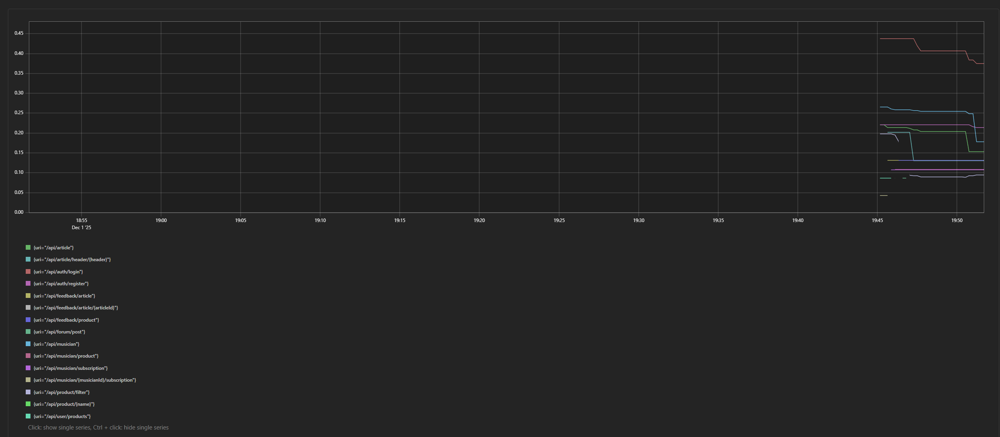
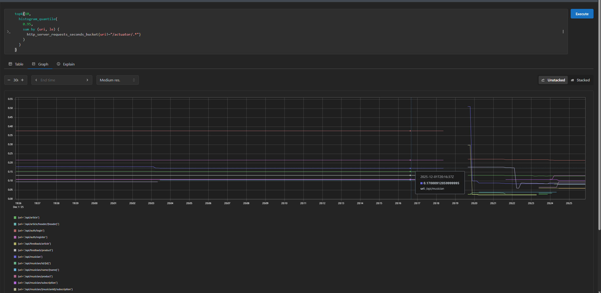
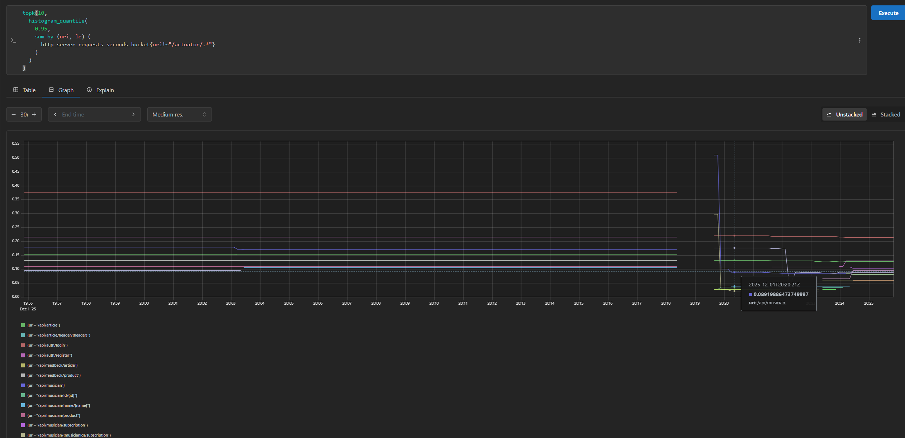
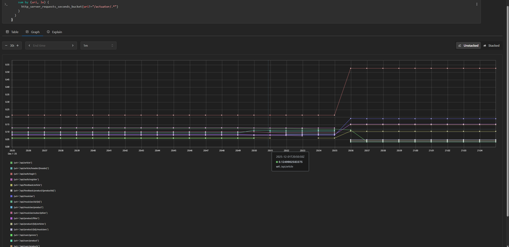
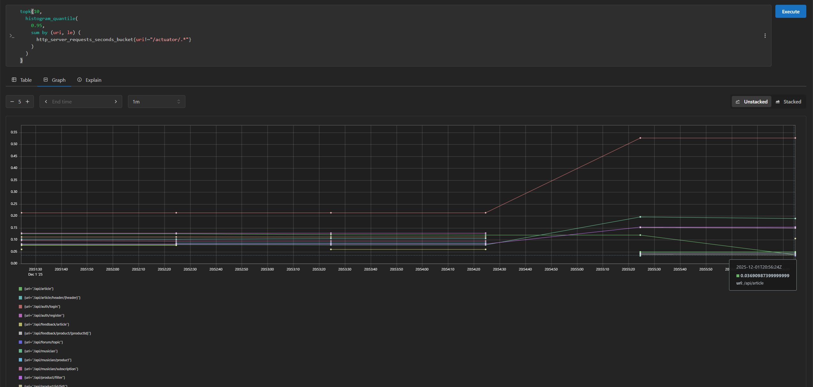

# Оптимизации

## Анализ времени выполнения

Для начала мы целых 7 минут с помощью специального запроса из [скрипта](../../../SQL/insertTestData.sql) вставляли тестовые данные в нашу БД. Оценку количества и соотношения строк в таблицах мы проводили ещё во время разработки данного приложения

Далее с помощью Prometheus мы можем посмотреть самые тяжелые запросы по 95-му перцентилю времени ответа командой:

```sql
topk(10,
  histogram_quantile(
    0.95,
    sum by (uri, le) (
      http_server_requests_seconds_bucket{uri!~"/actuator/.*"}
    )
  )
)
```

и увидели следующие результаты:



Благодаря уже имеющимся индексам любой фильтр по продуктам работает быстрее, чем авторизация, причём в 4 раза! Кроме того, видим также довольно медленную обработку запроса при следующих действиях:

- открытие страницы с музыкантами(-ом)
- авторизация
- открытие страницы со статьями

Проанализируем каждую из проблем по отдельности и посмотрим, как можно это решить

## Оптимизация страницы с музыкантами

### План оптимизации по музыкантам

Основная причина медленной работы страницы с музыкантами заключалась в паттерне N+1 запросов:

- **Список музыкантов** (`MusicianService.getMusician`) загружал страницу сущностей `Musician` через `MusicianRepository.findAll(page)`, а затем
  для *каждого* музыканта отдельно делал запросы в таблицы `musician_genre`, `type_of_musician_musician` и `musician_product` через соответствующие репозитории.
- **Список подписок пользователя** (`UserService.getSubscribedMusicians`) повторял ту же схему: для каждого музыканта в подписках выполнялись отдельные запросы за жанрами, типами и продуктами.

Это приводило к росту количества запросов к БД линейно от числа музыкантов на странице (3 дополнительных запроса на музыканта только по связям, не считая загрузки самих продуктов).

Мы переписали эту логику на батчевую выборку:

- В `MusicianGenreRepository`, `MusicianTypeOfMusicianRepository` и `MusicianProductRepository` добавлены методы `findByMusicianIdIn(List<Long> musicianIds)`, которые делают один запрос с `WHERE musician_id IN (...)` вместо множества одиночных запросов.
- В `MusicianService` добавлен приватный метод `buildMusicianInfoDTOs(...)`, который:
  - собирает все `musician_id` с текущей страницы,
  - одним батчем загружает все жанры, типы и продукты для этих музыкантов,
  - группирует результаты в мапы `musician_id -> список сущностей` и
  - на их основе формирует `MusicianInfoDTO` без дополнительных обращений к БД.
- В `UserService.getSubscribedMusicians` реализована аналогичная батчевая агрегация по списку музыкантов, на которых подписан пользователь.

Таким образом, вместо \(1 + 3 \cdot N\) запросов (страница музыкантов + три запроса по связям на каждого музыканта) теперь выполняется всего 4 запроса независимо от размера страницы. Это уменьшает нагрузку на БД и сокращает время ответа для эндпоинтов, связанных со списком музыкантов.

### Результаты оптимизации по музыкантам

Было:





Таким образом, снизили время ответа более чем в 2 раза!

Остальные метрики тоже стали чуть лучше, потому что для оптимизации этой метрики другие запросы тоже пришлось поправить, но об этом далее

## Оптимизация страницы со статьями

### План оптимизации по статьям

Для эндпоинта `/api/article` основной вклад во время ответа давала не база данных, а CPU‑нагрузка на бэкенд:

- Для каждой статьи в списке вызывался метод `convertToDTO`, который в свою очередь запускал внешний Markdown‑парсер через `ProcessBuilder` (метод `convertMarkdownToHtml`).
- Это происходило **для каждой статьи в выдаче** и каждый раз при запросе списка, то есть на один HTTP‑запрос приходилось десятки запусков внешнего процесса.
- Дополнительно присутствовал паттерн N+1 по авторам статей: для каждой статьи ленивая загрузка `author` порождала отдельный SELECT.

Мы оптимизировали этот путь следующим образом:

- Добавили в таблицу `articles` поле `html_content TEXT` и соответствующее поле в сущность `Article`.
- При создании статьи (`ArticleService.createArticle`) HTML‑представление текста теперь вычисляется **один раз**:

  ```java
  Article article = Article.builder()
        .header(createArticleDTO.getHeader())
        .text(createArticleDTO.getText())
        .author(author)
        .createdAt(LocalDateTime.now())
        .accepted(false)
        .htmlContent(convertMarkdownToHtml(createArticleDTO.getText()))
        .build();
  ```

- В методе `convertToDTO` мы больше не запускаем парсер для каждой статьи:
  - сначала берём уже сохранённое `article.getHtmlContent()`,
  - и только если оно по каким‑то причинам пустое (старые данные), вычисляем HTML через парсер и используем его.
- В `ArticleRepository` на методы выборки (`findByAccepted`, `findByHeaderContainingAndAccepted`, `findByAuthorIdAndAccepted`) добавлен `@EntityGraph(attributePaths = "author")`, чтобы автор подгружался одним JOIN‑ом, без N+1.
- В тестовом скрипте `insertTestData.sql` поле `html_content` для 1000 сгенерированных статей заполняется сразу (`html_content = text`), чтобы при бенчмарках не тратить время на парсинг вообще.

Итог:

- При запросе списка статей `/api/article` теперь нет многократных запусков внешнего парсера — мы просто читаем уже готовый HTML из поля `html_content`.
- Число SQL‑запросов для одной страницы статей снижено до фиксированного количества за счёт использования `@EntityGraph` вместо ленивой загрузки автора для каждой статьи.
- Это существенно уменьшает среднее и p95 время ответа для `/api/article` и освобождает CPU для обработки других запросов.

### Результаты оптимизации по статьям

Было:





Видим, что было 0.13, стало 0.03, что стало является существенным ускорением! Конечно, мы увеличили размер таблицы на целую строчку, статьи могут быть довольно большими, однако размер html-рендера не сильно больше, чем размер исходной markdown-разметки. Также не стоит обращать внимания на другие метрики, так как я их оптимизировал независимо. В конце будет сравнение, когда будут работать сразу все оптимизации (вдруг станет плохо?)

## Авторизация

### План оптимизации по авторизации

### Результаты по оптимазции авторизации
